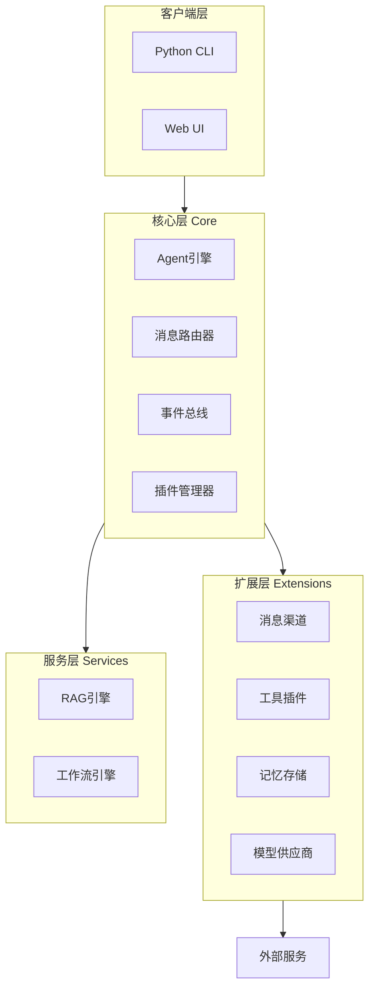

## 产品概述

OpenKylin（开放麒麟）：一个轻量级AI智能体框架，源自麒麟传说。极简内核、模块化设计、资源占用低，助您轻松构建高效智能的垂直领域AI助手。

## 核心功能

- **多消息渠道集成**：统一抽象层支持钉钉、微信、Telegram、Discord等主流平台
- **工具/插件系统**：基于entry_points的动态插件加载机制，支持加载 OpenClaw SKILL.md 格式
- **记忆/上下文管理**：短期会话记忆 + 长期向量存储分离设计
- **多模型支持**：OpenAI、Anthropic、Claude、Ollama、DeepSeek等主流模型
- **RAG知识库**：简化版向量检索 + 生成，支持私有知识库
- **工作流/Agent编排**：基于DAG的任务编排引擎
- **多客户端支持**：Python CLI、Web UI（移动端通过IM渠道接入）

## 差异化特点（对比OpenClaw）

- 更轻量：核心框架仅保留必要组件，无过度工程化
- 更简约：清晰的单一职责模块边界
- 更模块化：每个模块可独立使用，插拔式扩展
- 资源占用低：最小化依赖，适合个人开发者

## 技术栈选择

### 后端核心（Python）

- **核心框架**：Python 3.10+ + asyncio异步编程
- **插件系统**：importlib.metadata + entry_points
- **消息队列**：asyncio.Queue（轻量级）
- **数据存储**：SQLite（本地）+ 向量库（可选Chroma/Qdrant）
- **Web框架**：FastAPI（轻量REST API）

### 前端客户端（TypeScript/React）

- **Web框架**：React 18 + TypeScript
- **组件库**：Shadcn/UI（现代化企业级组件）
- **状态管理**：Zustand（轻量）
- **构建工具**：Vite

### IM渠道集成

- **钉钉**：自定义机器人/Webhook
- **飞书**：自定义机器人/Lark API
- **企业微信**：应用消息/群机器人
- **微信**：公众号/企业微信对接
- **Telegram**：Bot API
- **Discord**：Bot API
- **Slack**：Bolt框架

### AI模型接入

- **模型抽象层**：统一接口适配多种模型
- **支持供应商**：OpenAI、Anthropic Claude、Ollama（本地）、DeepSeek、通义千问

## 技术架构

### 系统架构图



### 核心设计原则

1. **单一职责**：每个模块只负责一件事
2. **依赖注入**：核心模块通过接口解耦
3. **插件化**：所有扩展均为插件，热插拔
4. **接口抽象**：定义清晰的分层接口

## 目录结构

```
open-kylin/
├── core/                          # [NEW] 核心框架
│   ├── __init__.py
│   ├── agent.py                   # [NEW] Agent引擎 - ReAct模式实现
│   ├── message.py                 # [NEW] 统一消息抽象
│   ├── event.py                   # [NEW] 事件总线
│   ├── router.py                  # [NEW] 消息路由器
│   └── plugin.py                  # [NEW] 插件管理系统
├── extensions/                    # [NEW] 扩展模块
│   ├── channels/                  # [NEW] 消息渠道插件
│   │   ├── __init__.py
│   │   ├── base.py                # [NEW] 渠道基类
│   │   ├── console.py             # [NEW] 控制台渠道
│   │   ├── webhook.py             # [NEW] Webhook渠道
│   │   ├── dingtalk.py            # [NEW] 钉钉渠道
│   │   ├── feishu.py              # [NEW] 飞书渠道
│   │   ├── wecom.py               # [NEW] 企业微信渠道
│   │   ├── telegram.py            # [NEW] Telegram渠道
│   │   ├── discord.py             # [NEW] Discord渠道
│   │   └── slack.py               # [NEW] Slack渠道
│   ├── tools/                     # [NEW] 工具插件
│   │   ├── __init__.py
│   │   ├── base.py                # [NEW] 工具基类
│   │   ├── registry.py            # [NEW] 工具注册表
│   │   └── skill_loader.py        # [NEW] OpenClaw Skill 加载器
│   ├── memory/                    # [NEW] 记忆存储
│   │   ├── __init__.py
│   │   ├── short_term.py          # [NEW] 短期记忆
│   │   └── long_term.py           # [NEW] 长期记忆（向量）
│   └── providers/                 # [NEW] 模型供应商
│       ├── __init__.py
│       ├── base.py                # [NEW] 模型接口抽象
│       ├── openai.py              # [NEW] OpenAI适配器
│       └── ollama.py              # [NEW] Ollama本地模型
├── services/                      # [NEW] 服务层
│   ├── rag/                       # [NEW] RAG引擎
│   │   ├── __init__.py
│   │   ├── vector_store.py        # [NEW] 向量存储
│   │   └── retriever.py           # [NEW] 检索器
│   └── workflow/                  # [NEW] 工作流引擎
│       ├── __init__.py
│       ├── dag.py                 # [NEW] DAG编排
│       └── executor.py            # [NEW] 执行器
├── clients/                       # [NEW] 客户端
│   ├── cli/                       # [NEW] Python CLI
│   │   ├── __init__.py
│   │   └── main.py
│   └── web/                       # [NEW] Web前端
│       ├── index.html
│       ├── package.json
│       └── src/
├── examples/                      # [NEW] 示例代码
│   └── basic_agent.py             # [NEW] 基础Agent示例
├── pyproject.toml                 # [NEW] 项目配置
├── README.md                      # [MODIFY] 更新文档
└── LICENSE                        # [NEW] 许可证
```

## 关键代码结构

### 核心接口定义

```python
# core/message.py - 统一消息抽象
class Message:
    role: str          # user/assistant/system
    content: str       # 消息内容
    metadata: dict     # 元数据
    channel: str       # 来源渠道

# core/agent.py - Agent引擎接口
class Agent(ABC):
    @abstractmethod
    async def run(self, message: Message) -> Message:
        """执行Agent处理"""
        pass
    
    @abstractmethod
    async def think(self, prompt: str) -> str:
        """思考步骤"""
        pass
    
    @abstractmethod
    async def act(self, tool_name: str, args: dict) -> Any:
        """执行工具"""
        pass

# extensions/channels/base.py - 渠道基类
class Channel(ABC):
    @abstractmethod
    async def send(self, message: Message) -> None:
        """发送消息"""
        pass
    
    @abstractmethod
    async def receive(self) -> Message:
        """接收消息"""
        pass

# extensions/providers/base.py - 模型供应商接口
class ModelProvider(ABC):
    @abstractmethod
    async def chat(self, messages: list, **kwargs) -> str:
        """聊天接口"""
        pass
```

## 实现注意事项

### 性能优化

- 异步优先：核心逻辑全部使用async/await
- 连接池：模型请求使用连接池复用
- 按需加载：插件采用延迟加载策略

### 轻量化设计

- 最小依赖：核心框架仅依赖标准库 + aiohttp
- 清晰边界：模块间通过接口通信，无隐式依赖
- 单一入口：统一通过Agent类暴露能力

### 可扩展性

- 插件发现：基于Python entry_points自动发现
- 接口版本：核心接口保持向后兼容
- 事件驱动：新增渠道只需实现Channel接口

### OpenClaw Skill 兼容层

为支持加载 OpenClaw Skill 市场的 Skill，实现以下功能：

1. **SKILL.md 解析器**

- 解析 YAML Frontmatter（name, description, version, metadata）
- 提取 Markdown Body 作为 Agent 指令

2. **依赖门控机制**

- 检查 required bins（命令行工具）
- 检查 required env（环境变量）
- 平台限制检查

3. **脚本执行器**

- 支持 scripts/ 目录下脚本执行
- 支持 Python/Shell 脚本
- 支持 references/ 文档按需加载

4. **Skill 加载路径**

- `<workspace>/skills/` - 工作区专属
- `~/.openkylin/skills/` - 全局共享
- 支持手动指定额外目录

## 设计风格

采用现代化简约设计风格，以深色主题为主，配合渐变色强调科技感。Web端使用React + TypeScript + Tailwind CSS + shadcn/ui组件库，打造专业且易用的管理界面。

## 页面规划

1. **首页/仪表盘**：展示Agent状态、活跃会话、快速操作
2. **会话管理**：历史会话列表、会话详情、上下文查看
3. **插件中心**：渠道/工具插件的安装、配置、启用状态
4. **知识库管理**：RAG知识库的配置、文档上传、检索测试
5. **设置中心**：模型配置、API密钥管理、系统参数

## 配色方案

- 主色调：深蓝渐变 (#0A1929 -> #0D2137)
- 强调色：青蓝色 (#00D9FF)
- 功能色：成功(#10B981)、警告(#F59E0B)、错误(#EF4444)

## Agent扩展

本项目为全新项目，暂无特定代码需要探索。计划中使用以下扩展：

- **skill-creator**：用于创建项目开发规范和最佳实践